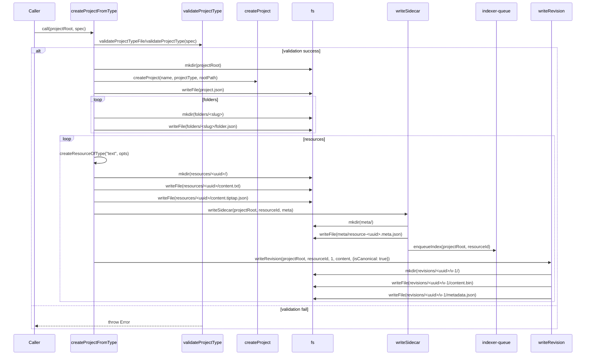

# Projects

## Creation Flow

This document describes the canonical data flow used when creating a project from a project-type spec. The current canonical entrypoint is `createProjectFromType` in frontend/src/lib/models/project-creator.ts; this file documents the sequence of function calls, the important in-memory objects, side effects on disk, and the exact files and directories created so you can develop and debug project-related features.

### High-level sequence

1. Input: caller supplies `projectRoot` and `spec` (either a `ProjectTypeSpec` object or a path to a JSON file).
2. Validation: the spec is validated using `validateProjectTypeFile` (for a file path) or `validateProjectType` (for an object). Validation failures throw an error and abort creation.
3. Project root: ensure `projectRoot` exists (calls `fs.mkdir(projectRoot, { recursive: true })`).
4. Create `project.json`: call `createProject(...)` to build the project model object, then write it to `<projectRoot>/project.json`.
5. Create folders: create `<projectRoot>/folders/` and, for each folder declared in the spec:
    - generate a `UUID` via `generateUUID()`
    - compute a slug from the folder name (internal `slugify` helper)
    - create a directory at `<projectRoot>/folders/<folder-slug>/`
    - write a descriptor JSON file at `<projectRoot>/folders/<folder-slug>/folder.json`
    - construct a `Folder` model object (id, slug, name, parentId, orderIndex, createdAt) and add it to the returned folder list.
6. Create default resources: create `<projectRoot>/resources/` and, for each `defaultResources` entry in the spec:
    - pick the destination folder (by slug or default to the first spec folder)
    - generate a `UUID` for the resource via `createResourceOfType`
    - for text resources: call `writeResourceToFile(projectRoot, resource)` which writes:
        - `<projectRoot>/resources/<uuid>/content.txt` — plain text content
        - `<projectRoot>/resources/<uuid>/content.tiptap.json` — TipTap JSON
        - `<projectRoot>/meta/resource-<uuid>.meta.json` — sidecar metadata (via `writeSidecar`)
    - call `writeRevision(projectRoot, resourceId, 1, content, { isCanonical: true })` to create the initial canonical revision at `<projectRoot>/revisions/<uuid>/v-1/`
    - build a `TextResource` model object and add it to the returned resources list
7. Return: the function returns the `project` model and arrays of `folders` and `resources` (as in-memory objects) for further processing.

### Call graph (simplified)

- `createProjectFromType(options)`
    - `validateProjectTypeFile(path)` or `validateProjectType(obj)`
    - `fs.mkdir(projectRoot, { recursive: true })`
    - `createProject({ name, projectType, rootPath })` -> returns project model
    - `fs.writeFile(<projectRoot>/project.json, JSON.stringify(project))`
    - for each folder spec:
        - `generateUUID()`
        - `slugify(name)` (local helper)
        - `fs.mkdir(<projectRoot>/folders/<slug>, { recursive: true })`
        - `fs.writeFile(<projectRoot>/folders/<slug>/folder.json, JSON.stringify(folderObj))`
    - for each default resource spec (text):
        - `createResourceOfType("text", { name, folderId, text, orderIndex, userMetadata })`
        - `writeResourceToFile(projectRoot, resource)` — writes `resources/<uuid>/content.txt`, `resources/<uuid>/content.tiptap.json`, and `meta/resource-<uuid>.meta.json`
        - `writeRevision(projectRoot, resourceId, 1, plainText, { isCanonical: true })` — creates `revisions/<uuid>/v-1/content.bin` + `revisions/<uuid>/v-1/metadata.json`

Note: `writeSidecar` itself performs the creation of the `meta/` directory and writes a canonical sidecar filename. It also enqueues background indexing after updating the sidecar.

### Files and directories created

Given a `projectRoot` directory, `createProjectFromType` will create the following layout (examples):

- `<projectRoot>/project.json`
    - The top-level project model created by `createProject(...)` and written as pretty JSON.
- `<projectRoot>/folders/` (directory)
    - `<projectRoot>/folders/<folder-slug>/` (one directory per `spec.folders` entry)
        - `<projectRoot>/folders/<folder-slug>/folder.json` — a small folder descriptor JSON file with the fields: `id`, `slug`, `name`, `parentId`, `orderIndex`, `createdAt`.
- `<projectRoot>/resources/` (directory)
    - `<projectRoot>/resources/<uuid>/` — one directory per resource (named by UUID)
        - `<projectRoot>/resources/<uuid>/content.txt` — plain text content
        - `<projectRoot>/resources/<uuid>/content.tiptap.json` — TipTap JSON representation
- `<projectRoot>/meta/` (directory)
    - `<projectRoot>/meta/resource-<uuid>.meta.json` — sidecar metadata file written by `writeSidecar`. The canonical filename is produced by `sidecarFilename(resourceId)` and the path by `sidecarPathForProject(projectRoot, resourceId)`; see the `sidecar` model for implementation details.
- `<projectRoot>/revisions/` (directory)
    - `<projectRoot>/revisions/<uuid>/v-1/` — initial revision directory for each resource
        - `<projectRoot>/revisions/<uuid>/v-1/content.bin` — serialized content payload
        - `<projectRoot>/revisions/<uuid>/v-1/metadata.json` — revision metadata (id, resourceId, versionNumber, isCanonical: true)

Example tree (minimal):

<pre>
myproject/
├─ project.json
├─ folders/
│  ├─ drafts/
│  │  └─ folder.json
│  └─ notes/
│     └─ folder.json
├─ resources/
│  └─ 0a1b2c3d-..../
│     ├─ content.txt
│     └─ content.tiptap.json
├─ meta/
│  └─ resource-0a1b2c3d-....meta.json
└─ revisions/
   └─ 0a1b2c3d-..../
      └─ v-1/
         ├─ content.bin
         └─ metadata.json
</pre>

### Sidecar details (exact behavior)

The `writeSidecar(projectRoot, resourceId, metadata)` helper (implemented in frontend/src/lib/models/sidecar.ts) does the following:

- Ensures the `<projectRoot>/meta/` directory exists.
- Computes a canonical filename for the resource sidecar: `resource-<uuid>.meta.json`.
- Writes the JSON metadata into `<projectRoot>/meta/resource-<uuid>.meta.json` (pretty-printed).
- Uses an internal lock helper (`withMetaLock`) to avoid concurrent writes.
- After successfully writing the sidecar, enqueues an async background indexing request via `indexer-queue` (dynamic import); enqueue errors are ignored.

Important: because the sidecar write enqueues indexing, creating a project will trigger the indexer for each resource sidecar written. If you need to debug indexing, watch for activity in the indexer queue or stub/mock `indexer-queue` during tests.

### In-memory models returned

The function returns the following in-memory objects:

- `project`: the result of `createProject(...)` — see the project model in `frontend/src/lib/models/project.ts` for fields.
- `folders`: array of folder model objects with fields `id`, `slug`, `name`, `parentId`, `orderIndex`, `createdAt`.
- `resources`: array of `TextResource` objects (for supported text templates) with fields including `id`, `name`, `slug`, `type`, `folderId`, `createdAt`, `plainText`, and `metadata` (which contains `orderIndex`).

### Error modes & debugging tips

- Validation failures: `validateProjectTypeFile` / `validateProjectType` return a result object; if `.success` is false the function throws an `Error` describing validation issues. Reproduce by supplying malformed spec JSON.
- Filesystem errors: most `fs` operations use `await` and will propagate errors. Common issues include permission errors or invalid paths.
- Partial writes: creation is not transactional — if an error occurs partway through, some files may have been written (for example: some folders or resources). When debugging, examine the filesystem tree under `projectRoot` to see which steps completed.
- Race conditions: `writeSidecar` uses `withMetaLock` to protect sidecar writes. If you encounter corrupted sidecars, confirm the lock implementation is used consistently.

### Where to look in the code

- Creation entrypoint: [frontend/src/lib/models/project-creator.ts](frontend/src/lib/models/project-creator.ts)
- Sidecar implementation: [frontend/src/lib/models/sidecar.ts](frontend/src/lib/models/sidecar.ts)
- UUID generation: [frontend/src/lib/models/uuid.ts](frontend/src/lib/models/uuid.ts)
- Project model builder: [frontend/src/lib/models/project.ts](frontend/src/lib/models/project.ts)

If you need a sequence diagram or a runnable example to exercise creation in tests, add a small integration test that calls `createProjectFromType({ projectRoot: tmpdir, spec: specObj })`, asserts the returned models, and inspects the filesystem under the temporary `projectRoot`.

### Sequence diagram (Mermaid)

---

Document created to assist development and debugging of project-related features. If you want a visual diagram (Mermaid) or a unit test scaffold, tell me and I'll add it.
